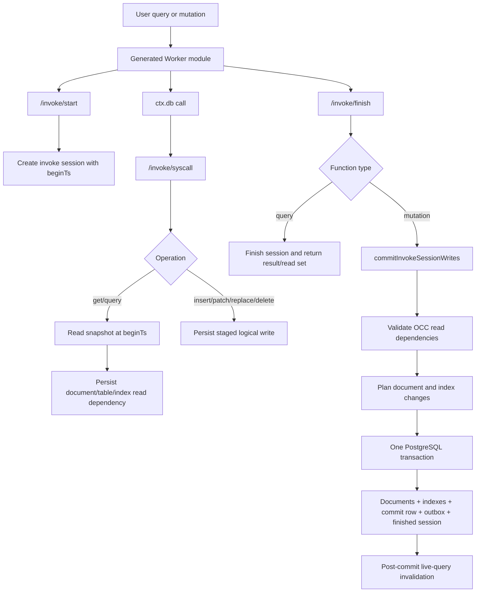

No—the user-code queries are not collected by `observeQuery`. In the current routed system, each `ctx.db` operation becomes an executor syscall. Reads are executed immediately and recorded as OCC dependencies; writes are staged. The final mutation commit later reloads both sets and commits them atomically.



### 1. User-code database calls

The generated Worker gives user code a `ctx.db` API. Calls such as:

```ts
ctx.db.get(...)
ctx.db.query(...)
ctx.db.insert(...)
ctx.db.patch(...)
```

are translated into `/invoke/syscall` requests in [GeneratedWorkerSource.ts](</C:/Users/Admin/Documents/github/convex-backend/custom/cloudflare-executor/packages/flarex-backend/src/artifactRuntime/GeneratedWorkerSource.ts:342>).

The HTTP executor routes `/invoke/start`, `/invoke/syscall`, and `/invoke/finish` into executor operations in [routeEffects.ts](</C:/Users/Admin/Documents/github/convex-backend/custom/cloudflare-executor/packages/executor-http/src/routeEffects.ts:156>).

This is request execution, not `observeQuery`.

### 2. What happens to queries and reads

At `/invoke/start`, `beginInvokeSession` creates a session and records a wall-clock `beginTs` in [sessions.ts](</C:/Users/Admin/Documents/github/convex-backend/custom/cloudflare-executor/packages/executor/src/sessions.ts:65>).

During each read syscall, `invokeSyscall`:

- Reads the document or query snapshot as of `beginTs`.
- Records exact document dependencies for point reads.
- Records table-read dependencies for table scans.
- Records index bounds for index queries.
- Overlays this mutation’s staged writes to provide read-your-writes behavior.

Those dependencies are stored in the invoke-session read tables. They mean:

> “This mutation’s result depended on these rows, table ranges, or index ranges as they existed at `beginTs`.”

They are later used by OCC validation.

### 3. What happens to writes

Mutation calls do not immediately change authoritative application rows.

`insert`, `patch`, `replace`, and `delete` are stored as logical staged writes associated with the invoke session. Multiple operations may be coalesced into the effective final write for a document.

So, before finish, there are two important collections:

- Read dependencies used for OCC.
- Staged logical document writes.

### 4. Where the “compile” step is today

There is not yet a separate production commit-compiler component in the routed legacy path.

Today that responsibility is folded into [commitInvokeSessionWritesInTransaction](</C:/Users/Admin/Documents/github/convex-backend/custom/cloudflare-executor/packages/persistence-postgres/src/commits.ts:157>).

It effectively lowers:

```text
persisted read dependencies
+ staged logical writes
+ current database state
+ validators and indexes
```

into:

```text
validated document revisions
+ index-entry changes
+ commit record
+ outbox event
+ completed invoke-session state
```

The roadmap’s explicit future compiler pipeline—journal → envelope → planner → prepared commit → executor—is a target architecture. It is not the normal routed implementation yet. See [roadmap 35](</C:/Users/Admin/Documents/github/convex-backend/custom/cloudflare-executor/roadmaps/35-commit-compiler-and-session-intent.md:99>).

### 5. Final mutation commit

When user code finishes, `finishInvokeSession` in [sessions.ts](</C:/Users/Admin/Documents/github/convex-backend/custom/cloudflare-executor/packages/executor/src/sessions.ts:420>) behaves differently by function type:

- Query: finishes the session and returns its result/read information; no application-data commit occurs.
- Mutation: invokes `commitInvokeSessionWrites`.

The persistence adapter opens one PostgreSQL transaction in [runtimePersistence.ts](</C:/Users/Admin/Documents/github/convex-backend/custom/cloudflare-executor/packages/persistence-postgres/src/runtimePersistence.ts:219>).

Inside that transaction, the commit logic:

1. Loads the staged writes.
2. Allocates the commit timestamp.
3. Validates document, table, and index read dependencies.
4. Loads current document state.
5. Applies and validates insert/patch/replace/delete semantics.
6. Produces document revisions and index changes.
7. Writes the commit record.
8. Writes the outbox event.
9. Marks the invoke session finished.

If OCC validation detects that relevant data changed since `beginTs`, the commit is rejected. The existing retry coordinator may then start a fresh attempt and rerun the mutation; it does not silently reuse the stale read set.

### Important boundary

Declarative V2 analysis and verifier-progress work does not replace this flow. It may eventually prepare verified runtime artifacts that execute through it, but it must not alter:

- OCC validation
- commit compilation/execution
- transaction journals
- idempotency outcomes
- commit/change feeds
- outbox behavior
- authoritative application rows

So the short version is:

```text
User ctx.db calls
  -> executor syscalls
  -> reads executed and dependencies recorded
  -> writes staged logically
  -> finish mutation
  -> OCC validation and write planning
  -> one authoritative PostgreSQL commit transaction
  -> post-commit notification
```