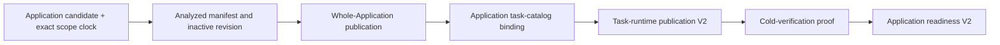

# Preflight 42: Application Task Runtime Authority

## Status And Scope

**Status:** Approved docs-first prerequisite (`SAP-CAA1`). Implementation is
not authorized by this document alone.

This preflight resolves the candidate-authority blocker discovered by
SAP-TRP5. It defines how Standard Application task-runtime publication and
readiness bind to the current Application Analysis candidate, revision,
publication, and task catalog without treating the displaced Declarative V2
candidate table or a task-runtime receipt as its own authority.

This is a prerequisite to persistence step 4 in
[`41-standard-application-task-runtime-readiness.md`](./41-standard-application-task-runtime-readiness.md).
It does not authorize task-aware readiness issuance, activation, Task System
launch, Worker Loader composition, hosted R2 operation, or production wiring.

## Why The Existing Contract Cannot Be Reused

The current `TaskRuntimePublicationReceiptV1` and
`ApplicationRevisionTaskBindingFrameV1` are concrete compatibility contracts.
They bind a `DeclarativeV2CandidateFrameV1` digest plus package, artifact,
source, and semantic digests. SAP-TRP4 persists those exact fields.

The current Application Analysis generation deliberately owns a different
authority chain:

- a backend-issued Application candidate ID bound to one Source Artifact V2
  root and exact scope clock;
- one analyzed Application manifest and receipt;
- one inactive Application revision;
- one whole-Application publication digest; and
- one Application task-catalog binding digest.

It has no foreign key or authenticated relationship to the old inert
Declarative candidate table. Roadmap 49 explicitly forbids adding such a
relationship to the new generation. The Application candidate ID is not the
old candidate digest, and the Application publication digest must not be
renamed or copied into an old `candidateSha256`, `packageSha256`,
`artifactSha256`, or `semanticRootSha256` field.

The failed SAP-TRP5 prototype decoded a V1 task-runtime receipt and supplied
those four values back to the verifier as expected evidence. That proved only
receipt self-consistency. It did not prove that the Application revision chose
the physical candidate represented by those values.

## Accepted Authority Cut

The replacement binds task runtime directly to the existing authenticated
Application task-catalog chain. The Application task-catalog binding already
commits:

- scope, Application candidate, analysis, and inactive revision identities;
- Source Artifact V2 root;
- whole-Application publication digest;
- canonical task-catalog digest and task count; and
- runtime-host identity and compatibility date.

Its digest is therefore the independent parent commitment for the new
task-runtime generation. No second candidate table, lookup, or compatibility
projection is needed.

The task-runtime receipt is evidence below the task-catalog binding. It never
selects or authenticates its own parent.

## Required Standard Application Contract Generation

Add a new concrete task-runtime publication contract generation rather than
reinterpreting V1 fields.

### Application revision task binding V2

The new binding commits:

- `applicationTaskCatalogBindingSha256`;
- canonical task-catalog digest and count;
- task-entry root;
- nullable task-runtime projection, group-manifest, and materialization-spec
  digests; and
- an exact empty-versus-populated shape.

It contains no Declarative candidate digest, package digest, artifact digest,
or semantic root. Source and Application publication authority are reached
through the authenticated task-catalog binding digest.

### Task-runtime publication receipt V2

The new canonical receipt commits:

- scope, Application candidate, analysis, and revision identities;
- Source Artifact V2 root and whole-Application publication digest;
- Application task-catalog binding and task-catalog digests;
- the Application revision task-binding digest;
- task-entry and nullable singleton roots;
- ordered immutable runtime-object membership; and
- object count and canonical byte total.

It has a distinct codec identity, strict canonical encoder/decoder, digest,
byte ceiling, role/count ceilings, and exact empty/populated correlation. It
does not retain fields whose only meaning belongs to the displaced Declarative
candidate contract.

### Preparation authority

The V2 preparation operation accepts only:

- an owned prepared Standard Application definition/source graph;
- an owned hashed canonical task catalog;
- authenticated Application task bindings from the same catalog owner;
- an owned Application publication/task-catalog authority projection; and
- trusted runtime materialization policy.

It rehashes and correlates these inputs before producing runtime objects and a
receipt. It does not accept a raw database row, arbitrary candidate frame, old
Declarative repository, or caller-selected digest bundle.

The existing V1 preparation and receipt codecs remain exact V1 compatibility
contracts until their preservation inventory is proven empty. V2 is not a V1
fallback, adapter, or dual-write path.

## Persistence Generation

Persistence adds Application-named V2 task-runtime publication and membership
tables instead of changing the meaning of the SAP-TRP4 V1 tables.

The V2 header has a restrictive foreign key to the exact existing Application
task-catalog tuple containing scope, revision, candidate, Application
publication digest, task-catalog digest, and task-catalog-binding digest. The
header stores the exact V2 receipt bytes and digest plus normalized V2 roots.
Membership rows reference the exact header receipt identity and retain the
canonical order, role, codec, object key, length, and digest.

The publication transaction:

1. locks the current scope clock;
2. locks and verifies the Application candidate's stored generation, fence,
   epoch, and Source Artifact root;
3. locks the inactive Application revision and whole-Application publication;
4. locks and canonically verifies the Application task catalog and binding;
5. captures only a receipt issued by the configured V2 Standard authority;
6. compares every receipt parent field to the independently loaded rows; and
7. inserts or exactly replays the header and ordered membership atomically.

No R2 operation or readiness write occurs in this transaction.

## SAP-TRP5 Snapshot Contract

After this prerequisite, the SAP-TRP5 reserve transaction may load:

- the current Application candidate/revision/publication/task-catalog chain;
- the exact V2 task-runtime publication and membership; and
- the existing schema, candidate-validation, physical, and unique-constraint
  readiness prerequisites.

The snapshot supplies expected evidence from the Application parent rows and
task-catalog binding. It supplies receipt evidence from the V2 receipt. It
compares the two before returning. No expected field may be derived solely from
the receipt field it is intended to authenticate.

The final readiness transaction reloads and compares the same Application
parents, receipt digest, and normalized membership. It accepts only a cold-
verification proof captured by the same configured backend authority instance.

## Compatibility And Migration Policy

- V1 receipt bytes and rows are never reinterpreted as V2.
- No V1 row is synthesized from an Application publication, and no V2 row is
  synthesized from a V1 receipt.
- New Application Analysis task-runtime publication uses only V2 after cutover.
- No dual write or read fallback is permitted.
- V1 remains readable only for an identified compatibility consumer.
- Before destructive V1 retirement, inspect configured environments and prove
  the V1 header/membership tables are empty or have an approved migration owner.
- If no shipped consumer or nonempty environment exists, guarded retirement may
  remove the unused V1 producer and tables in a separately approved cleanup.
- Existing Application task-catalog and publication rows are not rewritten.

## Failure Policy

| Condition | Result |
| --- | --- |
| Application candidate/revision/publication/catalog missing | deterministic not-ready or missing-parent result owned by the caller |
| Current scope authority differs from candidate authority | stale-authority failure |
| Task-catalog binding or publication digest differs | non-retryable authority mismatch |
| Receipt parent fields differ from independently loaded parents | non-retryable authority mismatch |
| Receipt or membership is malformed/noncanonical | stored-state corruption |
| Exact receipt already exists | exact replay |
| Different receipt exists for the revision | conflicting replay |
| Transaction response is uncertain | no success claim; exact cold replay allowed |
| Database resource failure | typed retryable persistence failure when classification permits |

An authority mismatch is never repaired by trying V1, selecting a different
Declarative candidate row, or trusting receipt self-consistency.

## Required Validation

### Standard Application

- V2 binding and receipt canonical round trips and golden digests;
- empty and populated publication preparation;
- exact Application publication/task-catalog correlation;
- wrong scope/candidate/analysis/revision/source/publication/catalog negatives;
- proof that V2 contains no old candidate/package/artifact/semantic fields;
- forged authority, hostile accessor/proxy, detached/shared byte, ownership, and
  asynchronous mutation tests; and
- explicit V1/V2 decoder separation with no fallback.

### Persistence

- fresh and immediately-prior-journal PGlite migrations;
- ordinary-role genuine-PostgreSQL migration in a non-public schema;
- empty and populated V2 publication plus exact replay;
- same IDs and source root with a changed parent publication/catalog digest;
- receipt self-consistent but parent-inconsistent negative proof;
- restrictive parent and membership foreign keys;
- malformed stored receipt/membership, rollback, hidden commit, competing
  publication, and reusable-connection proof; and
- a zero-write proof for every rejected authority case.

### SAP-TRP5 reconnection

- reserve snapshot derives expected evidence from Application parents;
- receipt evidence is compared independently before R2;
- parent drift and membership drift fail on final revalidation;
- no database lock remains open during R2; and
- step-2/foreign/other-instance backend proofs remain rejected.

## Implementation Order

Each checkpoint requires separate approval:

1. `SAP-CAA1-A`: add the pure V2 binding, receipt, preparation, and compatibility
   tests in Standard Application;
2. `SAP-CAA1-B`: add the V2 persistence tables/repository and PGlite plus genuine
   PostgreSQL proof;
3. `SAP-CAA1-C`: replace the discarded SAP-TRP5 snapshot prototype with the V2
   parent-versus-receipt correlation;
4. resume SAP-TRP5 readiness schema/issuance only after both parent and receipt
   evidence are independently authenticated; and
5. separately inventory and, if authorized, retire unused V1 code/tables.

## Explicit Non-Goals

This preflight does not authorize:

- a foreign key from Application Analysis to the old Declarative candidate;
- changing the meaning of a V1 codec, digest, column, or table;
- a generic candidate API or universal database abstraction;
- task-aware readiness issuance or activation;
- Task System definition/run creation, compute delivery, Worker Loader, or
  production routing;
- R2 credentials, object reads, repair, deletion, or garbage collection;
- OCC, commit, journal, idempotency, outbox, change-feed, or Application-row
  authority changes; or
- public SDK, route, Queue, Cron, deployment, or observability behavior.

## Stop Boundary

This preflight is complete when the accepted authority and compatibility cut is
recorded and linked from SAP-TRP4/SAP-TRP5. No implementation starts until the
user approves `SAP-CAA1-A`.

The prerequisite implementation ends after a private, production-inert V2
publication can be prepared, persisted, and independently correlated to the
Application task-catalog authority with PGlite and genuine-PostgreSQL proof. It
does not make task readiness, activation, launch, or hosted execution complete.
