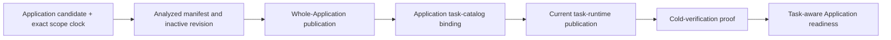

# Preflight 42: Application Task Runtime Authority

## Status And Scope

**Status:** `SAP-CAA1-A/B/C` implemented locally as one private correction and
reconnection in place. The current runtime publication now has a private
transaction-only readiness snapshot that independently compares Application
parent/catalog evidence with canonical receipt/membership evidence before any
object-store work. No parallel V2 runtime, legacy reader, dual write, fallback,
readiness issuance, activation, or production composition was added. External
deployment inventory remains a hard gate before applying this corrected
migration to any persistent owned environment.

This preflight resolves the candidate-authority blocker discovered by
SAP-TRP5. It defines how Standard Application task-runtime publication and
readiness bind to the current Application Analysis candidate, revision,
publication, and task catalog without treating the displaced Declarative V2
candidate table or a task-runtime receipt as its own authority.

This is a prerequisite to persistence step 4 in
[`41-standard-application-task-runtime-readiness.md`](./41-standard-application-task-runtime-readiness.md).
It does not authorize task-aware readiness issuance, activation, Task System
launch, Worker Loader composition, hosted R2 operation, or production wiring.

## Why There Is No Second Runtime Version

The Task System foundation was implemented recently, but the task-runtime
publication/readiness path remains private and production-inert. Repository
inspection on 2026-08-13 found:

- the runtime publication, receipt, connected-delivery, and launch factories
  are defined but have no non-test production composition consumer;
- the relevant package entries are private `internal/*` subpaths;
- no readiness repository, activation path, Worker Loader host, route, Queue,
  Cron Trigger, or deployment consumes the task-runtime publication; and
- the owning roadmaps explicitly stop before production activation and wiring.

The current `...V1` suffixes therefore do not prove a compatibility obligation.
They describe an internal implementation chronology that has not reached the
core Application execution path. Creating V2 beside it would preserve the
wrong authority, add migration and fallback surface, and contradict the
workspace naming rule for the accepted current implementation.

The current runtime contracts are corrected in place and use plain semantic
names, including:

- `ApplicationRevisionTaskBinding`;
- `TaskRuntimePublicationReceipt`;
- `TaskRuntimePublicationAuthority`;
- `PreparedTaskRuntimePublication`; and
- `TaskRuntimeReadiness` where the name belongs to this runtime owner.

Use `Legacy...` only if the inventory below proves that a displaced runtime
implementation must remain readable or executable. If there is no retained
consumer or persisted state, delete the old shape rather than manufacturing a
legacy product path.

This naming decision does not rename unrelated concrete compatibility
contracts such as Source Artifact V2, Task IDs, RPC envelopes, or already
shipped Application readiness generations. Those owners retain their version
markers when exact coexistence or decoding requires them.

## The Authority Defect Being Corrected

The displaced `TaskRuntimePublicationReceiptV1` and
`ApplicationRevisionTaskBindingFrameV1` shapes bound a
`DeclarativeV2CandidateFrameV1` digest plus package, artifact, source, and
semantic digests.

The current Application Analysis generation deliberately owns a different
authority chain:

- a backend-issued Application candidate ID bound to one Source Artifact V2
  root and exact scope clock;
- one analyzed Application manifest and receipt;
- one inactive Application revision;
- one whole-Application publication digest; and
- one Application task-catalog binding digest.

It has no foreign key or authenticated relationship to the old inert
Declarative candidate table. Roadmap 49 explicitly forbids adding such a
relationship to the new generation. The Application candidate ID is not the
old candidate digest, and the Application publication digest must not be
renamed or copied into old `candidateSha256`, `packageSha256`,
`artifactSha256`, or `semanticRootSha256` fields.

The failed SAP-TRP5 prototype decoded the current task-runtime receipt and
supplied those four values back to the verifier as expected evidence. That
proved only receipt self-consistency. It did not prove that the Application
revision chose the physical candidate represented by those values.

## Accepted Current Authority

The corrected runtime publication binds directly to the existing authenticated
Application task-catalog chain. The Application task-catalog binding already
commits:

- scope, Application candidate, analysis, and inactive revision identities;
- Source Artifact V2 root;
- whole-Application publication digest;
- canonical task-catalog digest and task count; and
- runtime-host identity and compatibility date.

Its digest is the independent parent commitment for the current task-runtime
publication. No second candidate table, lookup, compatibility projection, or
runtime generation is needed.

The task-runtime receipt is evidence below the task-catalog binding. It never
selects or authenticates its own parent.

## Corrected Standard Application Contract

### Application revision task binding

The current binding commits:

- `applicationTaskCatalogBindingSha256`;
- canonical task-catalog digest and count;
- task-entry root;
- nullable task-runtime projection, group-manifest, and materialization-spec
  digests; and
- an exact empty-versus-populated shape.

It contains no Declarative candidate digest, package digest, artifact digest,
or semantic root. Source and Application publication authority are reached
through the authenticated task-catalog binding digest.

### Task-runtime publication receipt

The current canonical receipt commits:

- scope, Application candidate, analysis, and revision identities;
- Source Artifact V2 root and whole-Application publication digest;
- Application task-catalog binding and task-catalog digests;
- the Application revision task-binding digest;
- task-entry and nullable singleton roots;
- ordered immutable runtime-object membership; and
- object count and canonical byte total.

It has a strict canonical encoder/decoder, stable codec identity, digest, byte
ceiling, role/count ceilings, and exact empty/populated correlation. These are
properties of the current persisted contract, not reasons to call the whole
implementation V2.

### Preparation authority

The corrected preparation operation accepts only:

- an owned prepared Standard Application definition/source graph;
- an owned hashed canonical task catalog;
- authenticated Application task bindings from the same catalog owner;
- an owned Application publication/task-catalog authority projection; and
- trusted runtime materialization policy.

It rehashes and correlates these inputs before producing runtime objects and a
receipt. It does not accept a raw database row, arbitrary candidate frame, old
Declarative repository, or caller-selected digest bundle.

## Consumer And Persistence Inventory Gate

Source inventory is currently empty: no non-test production source constructs
the publication receipt authority, publication preparation, publication
repository, launch authority, or connected runner. The private export paths and
test fixtures do not create a compatibility obligation.

Migration `0061_modern_avengers.sql` introduced the current task-runtime header
and membership tables on 2026-08-12. This checkout has no configured
PostgreSQL URL or deployment inventory proving whether that migration reached a
persistent environment. Source-level non-use is not proof that database state
is empty.

Before changing the persisted shape:

1. inspect every configured development, staging, and production migration
   journal that this repository actually owns;
2. count task-runtime publication and membership rows where the tables exist;
3. identify any external reader or writer not visible in this checkout; and
4. record the commands, environment identities, migration state, row counts,
   and owner conclusion without exposing credentials.

If all owned environments are absent or empty and no external consumer exists,
the correction may replace the unused schema/migration and current code in one
bounded cut. It must leave no legacy reader, dual write, fallback, or parallel
runtime table.

If any environment or consumer is nonempty, stop. Record that evidence and
obtain separate approval for the smallest explicit `Legacy...` retention or
data migration. Do not silently turn this preflight back into a V1/V2 design.

## Persistence Contract After An Empty Inventory

Persistence owns one current Application task-runtime publication and
membership schema. Its header has a restrictive foreign key to the exact
existing Application task-catalog tuple containing scope, revision, candidate,
Application publication digest, task-catalog digest, and task-catalog-binding
digest. It stores the exact current receipt bytes and digest plus normalized
roots. Membership rows reference the exact receipt identity and retain the
canonical order, role, codec, object key, length, and digest.

The publication transaction:

1. locks the current scope clock;
2. locks and verifies the Application candidate's stored generation, fence,
   epoch, and Source Artifact root;
3. locks and canonically verifies the Application task catalog and binding,
   whose existing restrictive foreign keys retain the inactive Application
   revision and whole-Application publication parents;
4. captures only a receipt issued by the configured Standard authority;
5. compares every receipt parent field to the independently loaded rows; and
6. inserts or exactly replays the header and ordered membership atomically.

No R2 operation or readiness write occurs in this transaction.

## SAP-TRP5 Snapshot Contract

After this prerequisite, the SAP-TRP5 reserve transaction may load:

- the current Application candidate/revision/publication/task-catalog chain;
- the exact current task-runtime publication and membership; and
- the existing schema, candidate-validation, physical, and unique-constraint
  readiness prerequisites.

The snapshot supplies expected evidence from the Application parent rows and
task-catalog binding. It supplies receipt evidence from the runtime receipt. It
compares the two before returning. No expected field may be derived solely from
the receipt field it is intended to authenticate.

The final readiness transaction reloads and compares the same Application
parents, receipt digest, and normalized membership. It accepts only a cold-
verification proof captured by the same configured backend authority instance.

## Failure Policy

| Condition | Result |
| --- | --- |
| Application candidate/revision/publication/catalog missing | deterministic not-ready or missing-parent result owned by the caller |
| Current scope authority differs from candidate authority | stale-authority failure |
| Task-catalog binding or publication digest differs | non-retryable authority mismatch |
| Receipt parent fields differ from independently loaded parents | non-retryable authority mismatch |
| Receipt or membership is malformed/noncanonical | stored-state corruption |
| Exact receipt already exists | exact replay |
| Different receipt exists for the revision | conflicting replay |
| Transaction response is uncertain | no success claim; exact cold replay allowed |
| Database resource failure | typed retryable persistence failure when classification permits |

An authority mismatch is never repaired by selecting a Declarative candidate
row, trusting receipt self-consistency, or trying a parallel runtime version.

## Required Validation

### Standard Application

- current binding and receipt canonical round trips and golden digests;
- empty and populated publication preparation;
- exact Application publication/task-catalog correlation;
- wrong scope/candidate/analysis/revision/source/publication/catalog negatives;
- proof that the current receipt contains no old
  candidate/package/artifact/semantic fields;
- hostile accessor/proxy, detached/shared byte, ownership, and asynchronous
  mutation tests; and
- source-level proof that no old/current fallback or dual path remains.

### Persistence

- the environment/consumer inventory above;
- fresh and immediately-prior-journal PGlite migrations;
- ordinary-role genuine-PostgreSQL migration in a non-public schema;
- empty and populated publication plus exact replay;
- same IDs and source root with a changed parent publication/catalog digest;
- receipt self-consistent but parent-inconsistent negative proof;
- restrictive parent and membership foreign keys;
- malformed stored receipt/membership, rollback, hidden commit, competing
  publication, and reusable-connection proof; and
- a zero-write proof for every rejected authority case.

### SAP-TRP5 reconnection

- reserve snapshot derives expected evidence from Application parents;
- receipt evidence is compared independently before R2;
- parent drift and membership drift fail on final revalidation;
- no database lock remains open during R2; and
- step-2, foreign, and other-instance backend proofs remain rejected.

## Implementation Order

The original implementation order was:

1. `SAP-CAA1-A`: record the external consumer/deployment inventory, then correct
   the pure Standard Application binding, receipt, preparation, names, and
   tests in place;
2. `SAP-CAA1-B`: after an empty inventory, correct the current persistence
   schema/repository and prove PGlite plus genuine PostgreSQL behavior;
3. `SAP-CAA1-C`: replace the discarded SAP-TRP5 snapshot prototype with the
   parent-versus-receipt correlation;
4. resume task-aware readiness issuance only after both parent and receipt
   evidence are independently authenticated; and
5. create a legacy-retention checkpoint only if concrete inventory evidence
   requires one.

The approved correction implemented steps 1 and 2 together because the private
persistence repository directly compiles against the corrected Standard
Application receipt. Keeping only step 1 would have required a temporary alias
or compatibility reader for an implementation with no retained consumer,
which would contradict this preflight's no-parallel-path decision. Step 3 is
now complete as a separate production-inert checkpoint. Task-aware readiness
issuance, final revalidation/commit, activation, and launch remain
unimplemented.

## Local Implementation Receipt

Completed on 2026-08-13:

- replaced the current task-runtime publication and revision-binding names with
  plain semantic names while retaining version markers on concrete object,
  Task Definition, RPC, and persisted SQL compatibility contracts;
- removed the Declarative candidate frame/digest plus package, artifact, and
  semantic roots from publication preparation, binding, receipt, and readiness
  evidence;
- made the Application task-catalog binding, Application publication digest,
  Source Artifact root, and scope/candidate/analysis/revision tuple the exact
  parent authority;
- corrected migration `0061_modern_avengers.sql`, its Drizzle snapshot, schema,
  publication repository, and test fixtures in place; and
- added exact negative coverage for every Application parent facet and for a
  changed independently stored Application publication digest.

Completed for `SAP-CAA1-C` on 2026-08-13:

- extended the existing `ApplicationTaskCatalogSnapshotPort` to expose its
  already authenticated canonical catalog through a copy-on-read operation;
- added one private transaction-only runtime-readiness snapshot port that
  locks and correlates the current scope clock, inactive revision, Application
  candidate/publication, authenticated task catalog, canonical runtime receipt,
  and normalized object membership;
- derives readiness parent evidence only from the independently authenticated
  Application parent/catalog side and never from the receipt field it checks;
- returns `null` when the current runtime publication is absent, with no R2
  call or readiness write; and
- proves a structurally self-consistent receipt with a different Application
  publication parent fails before object-store work.

Inventory evidence for this checkout:

- no non-test production composition consumer was found;
- no configured development, staging, production, or shared PostgreSQL URL was
  present in the working shell;
- local PGlite and a disposable PostgreSQL 18 instance prove the corrected
  migration/repository, but do not claim that an unknown external environment
  is empty; and
- therefore deployment remains blocked until an owner supplies and audits each
  actual persistent environment named by the deployment process.

Validation receipt:

- Standard Application typecheck and 69 tests passed;
- backend typecheck and 17 focused object-store/readiness tests passed;
- persistence typecheck passed;
- PGlite publication plus full migration-chain tests passed;
- genuine PostgreSQL 18 publication tests passed against a disposable local
  instance; and
- Trigger compatibility boundary check passed.

`SAP-CAA1-C` validation adds focused PGlite coverage for missing, empty,
populated, ownership, stored-membership drift, and self-consistent
parent-inconsistent receipt cases, plus a genuine PostgreSQL 18 transaction
and reusable-connection proof. This checkpoint changes no schema or migration.

## Explicit Non-Goals

This preflight does not authorize:

- a foreign key from Application Analysis to the old Declarative candidate;
- a parallel V2 runtime implementation, dual write, comparison path, or read
  fallback;
- preserving an unused implementation under `Legacy...` without evidence;
- changing unrelated concrete wire, RPC, Source Artifact, or Application
  readiness compatibility contracts;
- a generic candidate API or universal database abstraction;
- task-aware readiness issuance or activation;
- Task System definition/run creation, compute delivery, Worker Loader, or
  production routing;
- R2 credentials, object reads, repair, deletion, or garbage collection;
- OCC, commit, journal, idempotency, outbox, change-feed, or Application-row
  authority changes; or
- public SDK, route, Queue, Cron, deployment, or observability behavior.

## Stop Boundary

This preflight is complete when the correction-in-place decision and inventory
gate are recorded and linked from SAP-TRP4/SAP-TRP5. No implementation starts
until the user approves `SAP-CAA1-A`.

The prerequisite implementation ends after one private, production-inert
current runtime publication can be prepared, persisted, and independently
correlated to the Application task-catalog authority with PGlite and
genuine-PostgreSQL proof. It does not make task readiness, activation, launch,
or hosted execution complete.
