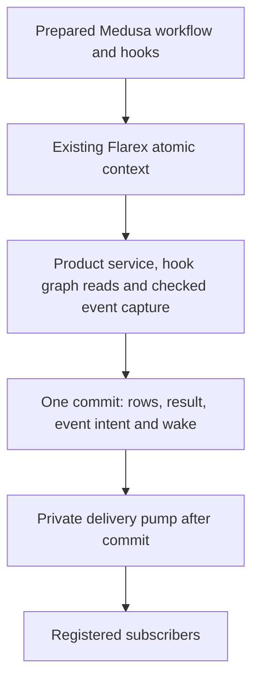

# Native Medusa Workflow Integration

## Status And Decision

Status: connected preflight complete; implementation of the proposed execution
and durable-event capability is pending approval. The user has authorized
modifying promoted Medusa fork source. The remaining decision is the concrete
capability below, including its shared publication and persistence changes.
No workflow runtime or event schema has been promoted by this preflight.

Recommendation: bring the actual `create-product-tags` workflow and its needed
SDK logic into private workspace packages, adapt them to the existing atomic
commerce owner, and prove hooks and durable events in the same capability.
[Topic 07](./07-durable-workflow-events.md) owns the event contract; this note
owns the connected integration and execution order.

The completed [atomic composition](./09-atomic-composition.md) and
[Local Graph Query](./06-local-graph-query.md) are the starting point. This
profile uses their bounded SQL transaction; it does not add relational journal
or OCC semantics. Product remains the business consumer, with Currency reads
available to prove that a registered hook can use another admitted participant.

## Outcome And Limits

The private host runs the promoted Product-tag workflow with either its
unhandled hook or one registered, trusted hook. The actual Product service
creates the tags. Steps and the hook share one authenticated atomic context,
pending reads, budgets and root result. Module events and the workflow event
become durable only with the successful commit. A restarted private dispatcher
can deliver them from storage without rerunning the workflow.

The first profile admits ordered finite steps, transforms, step references,
`StepResponse`, `WorkflowResponse` and the selected named hook behavior.
Ordinary Promise-returning module calls may be awaited; Medusa's durable
`async` step option is a different capability and is refused. Reject unsupported
options during preparation, before any service mutation: parallel branches,
scheduled/durable steps, step retries, nested workflows, waits/signals,
post-completion cancellation and remote side effects. Do not silently serialize
a parallel workflow or fall back to another engine.

No new commerce module, full `create-products`, remote join, Module Link,
public `ctx.workflow`, application sandbox exposure, general plugin container,
production dispatcher, Cloudflare provider, Task extension or distributed lock
is included. Only reviewed trusted callbacks are admitted to this host profile.
A timeout or restricted resolver is not a sandbox and cannot certify arbitrary
JavaScript hooks as free of external effects.

## Current Source Evidence

The reference is [SOURCE.json](../../third_party/medusa/SOURCE.json), fork
revision `48d5cc675e4e8bc821e22c20c88a751acc66fb5f`, package baseline 2.13.4.
The active workflow SDK is not installed yet. The reference stays inert;
modified promoted packages become the executable fork.

| Inspected owner | Finding and decision |
| --- | --- |
| [Product-tag workflow](../../third_party/medusa/upstream/packages/core/core-flows/src/product/workflows/create-product-tags.ts) | Creates tags, declares `productTagsCreated`, transforms returned IDs and invokes `emitEventStep`. It has no Graph Query call itself; query proof belongs in a registered hook without changing its business sequence. |
| [Creation step](../../third_party/medusa/upstream/packages/core/core-flows/src/product/steps/create-product-tags.ts) | Calls actual `createProductTags`, returns records and compensation IDs, and declares a delete compensator. Existing adapter commands already accept a batch. |
| [Composer](../../third_party/medusa/upstream/packages/core/workflows-sdk/src/utils/composer/create-workflow.ts) and [step factory](../../third_party/medusa/upstream/packages/core/workflows-sdk/src/utils/composer/create-step.ts) | Build definitions and handlers through `WorkflowManager`; step configuration can update that manager. Dev-server registration and broader execution methods are also connected. Swapping one engine service leaves those dependencies intact. |
| [WorkflowManager](../../third_party/medusa/upstream/packages/core/orchestration/src/workflow/workflow-manager.ts) | A process-global name registry constructs `TransactionOrchestrator` and a scheduler. Name registration does not bind a workflow/hook revision to Flarex authority. |
| [LocalWorkflow](../../third_party/medusa/upstream/packages/core/orchestration/src/workflow/local-workflow.ts) and [export wrapper](../../third_party/medusa/upstream/packages/core/workflows-sdk/src/helper/workflow-export.ts) | Construct runtime/container state, resolve loaded modules, expose retry/cancel/resume and finish through event-group release. Do not adopt their whole runtime as the native execution owner. |
| [Hook factory](../../third_party/medusa/upstream/packages/core/workflows-sdk/src/utils/composer/create-hook.ts) | Registers a replaceable no-op step, permits one handler, and supports a hook-result reference. Preserve selected behavior and reject duplicate or late registration. |
| [Step handler](../../third_party/medusa/upstream/packages/core/workflows-sdk/src/utils/composer/helpers/create-step-handler.ts), [reference resolution](../../third_party/medusa/upstream/packages/core/workflows-sdk/src/utils/composer/helpers/resolve-value.ts) and [builder](../../third_party/medusa/upstream/packages/core/orchestration/src/transaction/orchestrator-builder.ts) | Reference and definition-building mechanics are reusable. Step-context construction currently requires transaction/orchestrator objects; adapt the seam rather than fabricating a distributed transaction. |
| [Event step](../../third_party/medusa/upstream/packages/core/core-flows/src/common/steps/emit-event.ts) and export completion | Carries a group and clears selected events on compensation. Completion clears failed/reverted groups; release failure can invoke `flow.cancel`. Adapt that policy for delivery after a Flarex commit. |
| [Product binding](../../packages/medusa-adapter/src/product-module.ts) and [local events](../../packages/medusa-adapter/src/product-local-events.ts) | Current emit admits selected internal module events; release/clear are refused. Local validation correlates events with row/lifecycle facts but does not persist delivery. |
| [Atomic host](../../packages/persistence-postgres/src/atomicCommerce/host.ts) | Refuses event capture and validates participants with an empty event list. Public Product writes require an explicit event-admitting extension. |
| [Publication model](../../packages/persistence-postgres/src/commitPublication/scopePublicationModel.ts) and [publisher](../../packages/persistence-postgres/src/commitPublication/publication.ts) | No business-event contribution exists. Typed event facts and delivery state are real persistence work, not a feature obtained by renaming the wake outbox. |

Current [Medusa hook documentation](https://docs.medusajs.com/learn/fundamentals/workflows/workflow-hooks)
also describes one handler per hook, and its
[compensation documentation](https://docs.medusajs.com/learn/fundamentals/workflows/compensation-function)
explains reverse business actions. These explain intent; executable compatibility
is assessed against the pinned fork, not a newer documentation release.

## What Was Challenged

1. **Copying the SDK unchanged and swapping one service.** The connected source
   constructs its own orchestrator and mutable global registry. Modify the
   promoted composer/runner boundary explicitly.
2. **Rewriting composition because execution becomes native.** Reuse the builder,
   proxy/reference machinery, transforms, response representation and hooks where
   selected semantics fit. Algorithm changes require source-based regressions.
3. **Building an unrestricted event bus before selecting a workflow.** Admit only
   the actual module/workflow event contracts this flow emits. Generic
   persistence mechanics do not grant arbitrary event publication authority.
4. **Equating compensation with SQL rollback.** This profile aborts all pending
   writes once and must not run the delete compensator against aborted work.
   That is an explicit fork difference, not unchanged cancellation semantics.
5. **Moving workflow hooks after commit.** The admitted hook remains a workflow
   step: it can read pending rows and fail the operation. Subscriber delivery
   happens separately after commit. Remote or unbounded hooks need another profile.
6. **Making only the workflow event succeed.** Public Product creation emits
   module events too. Preserve both families and their distinct metadata.
7. **Using Task delivery or the commit wake as a generic queue.** Task delivery
   is tied to admitted runs/effects. The current wake kind is
   `deployment_sync_commit_wake_v1`. Neither is an interchangeable event envelope.

## Source Promotion And Ownership

Proposed private ownership follows the existing Medusa package layout:

| Source or owner | Disposition |
| --- | --- |
| `core-flows/src/product/workflows/create-product-tags.ts`, its creation step and `common/steps/emit-event.ts` | **Port** to selected `packages/medusa-core-flows` sources. Preserve business sequence and response shape; adapt exact imports/context types. Retain the compensation declaration, with explicit atomic execution policy. |
| `workflows-sdk/src/utils/composer/{create-workflow,create-step,create-hook,transform}.ts` | **Port and rewrite connected boundaries** in `packages/medusa-workflows-sdk`: preparation/registration, configuration checks, runtime binding and hook sealing. Preserve reusable composition. |
| `helpers/{proxy,resolve-value,step-response,workflow-response}.ts`, orchestration symbols, required errors/types and the builder | **Port/reuse** selected mechanics under the workflow definition owner, with provenance for extracts. Remove unnecessary barrel dependencies; reuse already-promoted owners where suitable. |
| `helpers/create-step-handler.ts` and runtime-facing `composer/type.ts` | **Rewrite** the context seam around the admitted native runner. Preserve selected references/results; expose no fake orchestrator, SQL manager or retry authority. |
| `WorkflowManager`, `LocalWorkflow`, `workflow-export.ts`, `MedusaWorkflow`, scheduler and distributed-transaction persistence/retry chain | **Keep reference-only** for this profile. Reuse suitable definition algorithms directly; do not promote an executable fallback runtime. |
| Dev-server detection, global loaded-module cache and mutable global execution registry | **Delete from the promoted runtime dependency chain**. Definition construction and runtime instances must be separable. |
| Existing framework/types/utils exports | **Extend exact required imports**, including a private framework workflow-SDK facade where needed. Do not import every commerce module through a core-flows barrel. |
| `packages/medusa-adapter` | **Keep/extend** workflow preparation/binding and a narrow Medusa resource view backed by authentic command tokens and Local Graph Query. Module names remain here. |
| Atomic commerce, event validation, shared publication and persistence | **Keep/extend** authenticated event capture, sealed contribution and Topic 07's durable event/delivery contracts. Retain transaction, scope-lock order, native OCC and root recovery owners. |
| Standalone Product local-event mode | **Keep** for supported private callers and original tests. Select durable mode explicitly; do not also call the local destination or silently fall back to it. |

Promotion includes the exact resulting import closure, source hashes,
extraction/adaptation classifications and test ports in the owning inventory.
Active fork packages may be modified. Never import the inert island at runtime
or weaken source checks to avoid listing dependencies. Proposed package names
above do not imply those packages already exist.

## Definition, Execution And Identity

Preparation captures the graph, step options, handlers, hook set, input/result
validators, resource requirements, module-command bindings and event contracts.
Preserve useful authoring input/output/hook inference while checking unknown
inputs and foreign results. Metadata grants no installation authority.

Keep authoring small: definitions and hooks are supplied by authors; standard
host binding is assembled once. Do not make each workflow wire repositories,
publishers, schedulers and service factories separately.

Use an owned prepared registry. If retained synchronous composition requires
ambient context, restrict it to definition building and restore it on every
exit. It cannot select request services or mutate a prepared hook set. Separate
hosts must support different reviewed definitions with the same workflow name.

Bind a trusted workflow-code/hook-bundle content identity and the execution
profile into the existing host `identityAndAccessPolicy` input; the host already
hashes this for retained-result authentication. Trusted assembly owns that
identity. Caller labels, workflow names, schema artifact hashes or
`Function.toString()` alone cannot prove the code revision. Demonstrate that a
changed code/hook bundle cannot reuse an old result under the same request key.
Public bundle distribution and application activation remain separate work.

Each run borrows the atomic context. Registered service methods invoke actual
command tokens; graph reads use Local Graph Query. Existing scoped bridges
construct fresh module services. The resource view resolves only admitted
services/methods and exposes no transaction manager or arbitrary DI lookup.

Execute admitted definition order with one owned result context. Preserve
required internal undefined/response/reference semantics; validate data at
module-call, event and final-result boundaries rather than serializing proxy or
symbol objects as native command input. Every evaluated step/transform consumes
an explicit bounded budget even without a database call. Charge captured input,
step data, events and results against root limits; do not enlarge them for proof.

The current atomic context exposes only call/refuse, so the runner cannot
already charge arbitrary intermediate values to the root. Add a narrow scoped
budget/capture capability issued by that same lifetime owner alongside event
capture. Do not give the runner an independent full allowance that ignores
budgets already consumed by module calls, or expose the underlying manager.

Interruption or rejection leaves the root failed/rollback-only. Existing Promise
ownership drains/revokes borrowed work; a caught error or `Promise.race` cannot
authorize a later write. Preserve typed failures and the complete refusal Cause.
Exact root replay returns the retained result without rerunning steps, hooks,
transforms or capture. Commit uncertainty uses current recovery-only routing.
There are no persisted step checkpoints or implicit workflow retries.

## Hooks And Failure Contract

Preserve optional `productTagsCreated`, its created-tag input and
`additional_data`, and duplicate-handler rejection. Register hooks before
sealing preparation; absence remains a no-op. Characterize hook-result references
used by selected SDK cases. This consumer does not require every validator or
conditional feature from the SDK.

The proof registers a trusted hook that graph-reads its pending tags and reads
Currency through another admitted participant. A failure case rejects after
those reads. The original workflow's business sequence remains intact.

Admit the creation step with an explicit transaction-covered compensation policy.
Its delete callback is not invoked after rollback or after a subscriber failure
following commit. Unknown compensators/external-effect hooks are not silently
ignored; their definitions cannot be admitted. Post-completion business undo
requires a new command or separately designed durable workflow profile.

## Event And Commit Extension

[Topic 07](./07-durable-workflow-events.md) specifies event identity, typed
capture, persistence, claims, restart and retention. This crosses shared
publication and requires an additive persistence migration. These are proposed
owner changes, not an incidental SDK import or a defect exposed by a test.

Collect module-event handoffs under the participant's existing fact validator.
Bind workflow events to their admitted definition and successful step output.
Unknown names/payloads, foreign group IDs or destinations cannot bypass admission.

Seal intent after successful workflow/hook completion and persist it with row
facts, root result and the common wake. Only the outer owner commits. Delivery
uses fresh scope-bound services after commit and never the command's SQL manager.

## Implementation Order And Completion Proof

One connected capability, with implementation checkpoints rather than new
approval gates for individual files:

1. Inventory and promote/adapt the selected definition closure. Characterize
   composition, transforms, references, responses, definitions, duplicate hooks
   and selected absence behavior against retained source tests.
2. Implement registry/identity and atomic execution with actual Product and Graph
   Query bindings. Refuse unsupported options before mutation.
3. Add typed capture, sealed publication contribution, migration and private
   delivery/repair; connect both original workflow and public-service events.
   An in-memory callback is not a completed substitute.
4. Run the real workflow and hooks on PGlite and ordinary-role PostgreSQL. Prove
   one commit, pending cross-participant reads, DTOs, both event families, late
   failure, cancellation, escaped-context refusal, bounds and replay isolation.
5. Fault event insertion, publication, physical commit and acknowledgement/
   delivery. Restart host/pump; prove stored-intent recovery, fenced claims,
   subscriber isolation, duplicate behavior and no compensating writes after
   successful commit.
6. Preserve Product/Currency, atomic, graph, publication, recovery and wake
   regressions. Run typechecks, migrations, promotion/portability checks, scoped
   lint and both standing reviewers. Clean temporary databases and reconcile
   owning roadmaps with the proven result.

Selected retained SDK evidence:
[compose.spec.ts](../../third_party/medusa/upstream/packages/core/workflows-sdk/src/utils/composer/__tests__/compose.spec.ts)
(sequential composition, transforms, property/nested references, duplicate hooks,
grouped success/failure),
[index.spec.ts](../../third_party/medusa/upstream/packages/core/workflows-sdk/src/utils/composer/__tests__/index.spec.ts)
(step/hook results, transformer failures, hook absence), and
[builder tests](../../third_party/medusa/upstream/packages/core/orchestration/src/__tests__/transaction/orchestrator-builder.ts).
Preserve original assertions for compatible selected cases and separately label
intentional atomic differences. If native binding requires changing a test's
fixture or invocation arrangement, record that adaptation; do not classify a
rewritten execution case as an unchanged upstream test. Source inspection did not identify a focused
unit suite for `create-product-tags`; add its real private workflow proof.
Entity-matching HTTP suites do not automatically belong in this host's closure.

Full orchestrator tests include durable retries, parallel/nested flows and
post-completion cancellation outside this profile. Enumerate deferred cases;
do not claim whole-SDK parity or silently skip failing admitted cases. Private
Node/database tests do not prove deployed Cloudflare or production readiness.

## Retirement And Remaining Gates

Remove temporary probes, fake runtime/container implementations, duplicate
reference resolvers and provisional delivery callbacks introduced during
implementation. Retain the immutable reference and supported standalone module
paths. No production workflow engine is displaced today; no permanent legacy
runtime fallback is needed in the new package.

Waits, cross-commit compensation, external effects, Tasks, leases, general event
subscriptions, more modules, nested workflows and public serving follow only
when a selected next workflow needs them.
