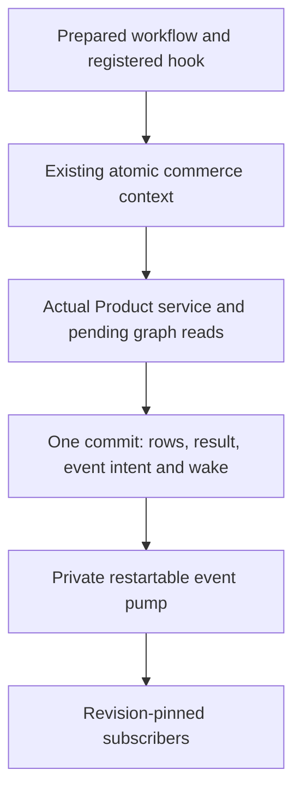

# Native Medusa Workflow Integration

## Status And Scope

Status: implemented as a private, finite atomic workflow profile. The active
fork runs the actual Product-tag workflow, optional registered hook, pending
Local Graph Query reads and both committed event families. [Topic 07](./07-durable-workflow-events.md)
owns event persistence and delivery; [Topic 09](./09-atomic-composition.md) owns
the existing atomic commerce transaction. These are one connected capability.

The host uses one authenticated, bounded SQL transaction. It does not add a
Task, relational journal/OCC engine, distributed lock or second commit owner.
Product supplies business semantics; Currency reads demonstrate another admitted
participant inside the same hook. No additional commerce module is admitted.

Only reviewed trusted callbacks are supported. A finite resolver and timeout
are not a sandbox and cannot establish that arbitrary JavaScript has no external
effects. Public application exposure, production delivery, Cloudflare deployment,
full create-products, remote joins and Module Link remain separate gates.

## Execution And Ownership

| Owner | Accepted responsibility |
| --- | --- |
| [medusa-core-flows](../../packages/medusa-core-flows/src/product/workflows/create-product-tags.ts) | Original business sequence: create tags, invoke the named hook, transform IDs, emit workflow events and return tags. |
| [medusa-workflows-sdk](../../packages/medusa-workflows-sdk/src/definition.ts) | Staged definitions, ordered builder, references, transforms, responses, immutable prepared hook registrations and selected execution through caller-owned ports. |
| [Product-tag adapter](../../packages/medusa-adapter/src/product-tag-workflow.ts) | Select module resources, validate native input/hook views and correlate workflow event IDs with successful creation output. |
| [Shared workflow host](../../packages/medusa-adapter/src/workflow/host.ts) | Derive participants, command allowlists, graph/event bindings and scoped resources from module-owned registrations. |
| [Native runner](../../packages/medusa-adapter/src/workflow-runtime.ts) | Own foreign callbacks and scoped service runners, charge root budgets and preserve sticky refusal/cancellation. |
| [Atomic commerce](../../packages/persistence-postgres/src/atomicCommerce/host.ts) | Authenticate installations, share one lifetime and transaction, validate participant facts, seal the result and event contribution, and use existing root recovery. |
| [Committed events](../../packages/persistence-postgres/src/commitEvents/store.ts) | Durable intent, completeness verification, fresh scope authority, fenced delivery claims and retained subscriber outcomes. |

The author defines steps, transforms, the response and exposed hooks. Trusted
host assembly supplies the reviewed code/hook revision and subscriber revisions.
The [shared host composition](./11-workflow-host-composition.md) assembles those
resources from module-owned registrations. Native callbacks receive inferred
resources; the Product-tag facade retains its business input, hook and event
policy without manual service wrappers or participant-list construction.

The resolver exposes only selected Product methods, graph reads and checked
emit. Its generic signature is the Medusa compatibility boundary; its type
argument grants no authority. There is no arbitrary DI lookup or SQL manager.
Each service call enters an authentic command using fresh scoped module services.

## Definition And Identity

Definitions are built synchronously. Construction-only ambient context is
restored on every exit and never selects request resources. The ordered builder
retains the pinned add-action/find-last-step mechanics; branching, movement and
persisted-transaction loading are not part of this profile.

Each definition owns authentic deferred references and an immutable captured
graph. Literal capture rejects cycles, accessors, custom prototypes, sparse
arrays and excessive depth/node counts without invoking getters. The prepared
hook set is an owned record, not a mutable process-global name registry. Separate
hosts can use the same workflow name with different hook bundles.

Trusted assembly supplies a content identity for the reviewed workflow code AND
hook bundle. The atomic host hashes it, admitted event contracts/routing and
subscriber revisions with its existing identity/access policy. A changed bundle
cannot reuse a retained result under the same request key. Caller labels,
workflow names, schema artifacts and Function.toString alone are not revisions.
Public bundle distribution and application activation remain later decisions.

The selected surface admits up to 64 ordered steps, deferred property/nested
references, one-to-seven-function transform chains, StepResponse, WorkflowResponse
and named hooks. Unsupported step options are refused during construction:
parallel, scheduled/durable async steps, retries, nested workflows, waits/signals
and post-completion cancellation. Do not silently serialize or fall back to the
original scheduler. Conditions/reconfiguration and hook validators are also
unadmitted.

## Runtime And Failure Contract

Every evaluated step/transform and every captured input, intermediate, event and
result consumes the SAME root call/byte/lifetime budget as module operations.
A workflow gets no independent full allowance. Internal own-undefined properties
and absent hook results use a charged omission envelope; module/event/final
results retain their strict native JSON boundaries. Undefined array members and
non-JSON runtime values are outside this selected capture contract.

The optional productTagsCreated hook receives created tags and additional_data.
It runs before commit and can read pending tags plus Currency through graph.
An absent handler is a no-op; duplicate registrations are refused. Hook-result
references remain available in the selected SDK. Registrations cannot change an
already prepared host.

The creation and event steps explicitly declare transaction-covered compensation.
Their original compensation callbacks remain in source, but the native runner
does not invoke them: failed pending work rolls back once. Unknown compensators
are refused unless trusted authoring explicitly declares this policy. That
annotation is an author obligation, not proof that an arbitrary callback is safe.

Hook failures, swallowed resource refusals, overlapping work and interruption
leave the root failed. Existing Promise ownership drains/revokes borrowed work;
escaped services cannot operate after closure. Exact replay returns the retained
root result without rerunning any step/hook/transform or event capture. Physical
commit uncertainty uses existing recovery-only routing. There are no persisted
step checkpoints or implicit workflow retries.

Subscriber delivery occurs after commit with fresh authority and no business
transaction manager. Its failure changes delivery evidence only; it cannot
replace a successful root result, delete committed tags or run compensation.

## Fork Provenance And Compatibility

The immutable reference is [SOURCE.json](../../third_party/medusa/SOURCE.json),
revision 48d5cc675e4e8bc821e22c20c88a751acc66fb5f, baseline 2.13.4. Active private
workspace packages contain the executable fork. Nothing imports the inert island
at runtime. The [promotion inventory](../flarexdb-framework-integration/preflight/medusa-currency-promotion.json)
pins every source/input, package dependency/export and available build output.
Workflow adaptations use an explicit workflowFork classification; preserved
Product/Currency source and original-test checks retain their strict policies.

| Pinned source | Active disposition |
| --- | --- |
| core-flows product/workflows/create-product-tags, product/steps/create-product-tags, common/steps/emit-event | Preserve business composer/service calls/event construction; relocate imports, mark transaction-covered compensation and omit undefined optional event options at the strict native boundary. |
| workflows-sdk create-workflow, create-step, create-hook and transform | Fork construction/registration and runtime binding; remove WorkflowManager and mutable global execution registration. |
| helpers/proxy and resolve-value | Retain staged property/reference and cached transform semantics; authenticate reference identity and use an Effect-native caller-owned runner. |
| helpers/step-response and workflow-response | Retain selected output/compensation-input and response/hook representations. |
| orchestration/transaction/orchestrator-builder | Extract ordered graph construction and return an owned immutable graph; no distributed transaction is fabricated. |
| WorkflowManager, LocalWorkflow, workflow-export, scheduler, distributed transaction persistence, loaded-module cache | Reference-only; no executable fallback or parallel legacy owner. |
| Existing standalone Product local-event profile | Retain for supported callers and original compatibility tests. Durable capture selects another explicit host profile and never also calls the local destination. |

[Composer regressions](../../packages/medusa-adapter/test/workflow-composer-upstream.test.ts)
retain selected business composers and assertions from pinned compose.spec.ts:
sequential steps, chained transforms, destructured/nested properties, arrays of
step results and mixed result objects. The hook-result case derives from
index.spec.ts. Invocation/fixtures use the native executor, Jest becomes Vitest,
no-input steps are explicit, and checked optional mock access preserves the same
expected values. These are adapted cases, not an unchanged whole-SDK suite.
Sequential cases exercise the extracted builder through actual composition.

Original tests requiring parallel branches, durable/async retries, nested
workflow execution, scheduler registration, wait/resume, remote effects,
post-completion cancel, conditional/configured steps or global workflow state
remain reference-only. No whole-SDK parity is claimed. The source did not contain
a focused create-product-tags unit suite; its new proof runs the real workflow.

## Validation Boundary And Remaining Gates

The [connected workflow scenarios](../../packages/medusa-adapter/test/product-tag-workflow.test.ts)
exercise both database drivers: pending hook reads, one commit, exact event
families, late rollback, cancellation, closed services, root replay/revision
isolation, uncertain commit recovery, publication faults, shared bounds, durable
restart after result expiry, stale claims, subscriber independence, corruption
and retention. Actual competing claims and outside-transaction visibility are
ordinary-role PostgreSQL proofs; PGlite is not a concurrency substitute.

Preserve original Product/Currency suites and atomic/graph, publication, recovery,
wake and migration regressions. Promotion/portable checks inspect the resulting
import closure. Node/database and browser-bundle checks do not establish deployed
Cloudflare or production dispatcher readiness.

The implemented [workflow host composition](./11-workflow-host-composition.md)
shares command wrappers, graph/event assembly, validation/refusal and scoped
runtime binding. Module-owned registrations reference existing command catalogs;
native types follow checked adapters. A second event-free composition proves
reuse with Currency retrieval and Product graph. Input/output Schemas preserve
encoded versus decoded representations across execution and replay. The module
constructor and transaction owner remain independent of workflow assembly.

The next selected workflow should determine further execution capabilities. Cross-commit
steps, waits/signals, external effects, general subscriptions, administrative
redrive, event pruning, Tasks, more modules and public serving remain separate
capabilities. No universal workflow architecture or automatic escalation from an
exceeded atomic budget is approved by this implementation.
