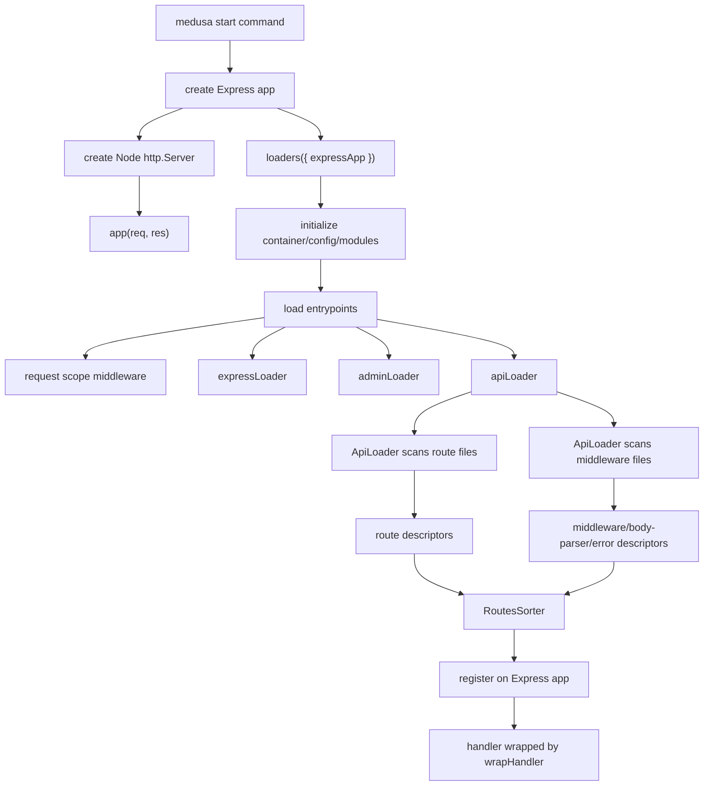

# Medusa HTTP Bootstrap And Express Coupling Research

Date: 2026-06-20

This note documents the current Medusa HTTP flow in this fork. It is a
research note, not an implementation plan. The goal is to understand how
request handling, route discovery, middleware registration, and Express coupling
work before deciding how to migrate this boundary to Cloudflare.

## Files Read

- `packages/medusa/src/commands/start.ts`
- `packages/medusa/src/loaders/index.ts`
- `packages/medusa/src/loaders/api.ts`
- `packages/medusa/src/loaders/admin.ts`
- `packages/core/framework/src/http/express-loader.ts`
- `packages/core/framework/src/http/router.ts`
- `packages/core/framework/src/http/routes-loader.ts`
- `packages/core/framework/src/http/routes-finder.ts`
- `packages/core/framework/src/http/routes-sorter.ts`
- `packages/core/framework/src/http/middleware-file-loader.ts`
- `packages/core/framework/src/http/types.ts`
- `packages/core/framework/src/http/utils/wrap-handler.ts`
- `packages/core/framework/src/http/utils/define-middlewares.ts`
- `packages/core/framework/src/http/middlewares/bodyparser.ts`
- `packages/core/framework/src/http/middlewares/error-handler.ts`
- Representative route and middleware files under `packages/medusa/src/api`.

## Current Request Flow



The public server entrypoint is still Node-first:

- `packages/medusa/src/commands/start.ts` imports `express`, `http`,
  `cluster`, `os`, `node-schedule`, and other Node runtime dependencies.
- It creates an Express application with `express()`.
- It creates a Node `http.Server`.
- The server delegates each request to `app(req, res)`.
- Optional tracing looks into `app._router.stack` to find the Express route
  path before delegating to Express.
- A `/health` route is registered directly on the Express app after Medusa
  loaders finish.

This means the current server command is not only using Express as a routing
library. It owns Node server creation, process signals, clustering, cron ping,
and Express stack introspection.

## Loader Flow

`packages/medusa/src/loaders/index.ts` is the main Medusa runtime loader.

Its responsibilities include:

- Loading feature flags and config.
- Registering logger and remote query placeholders in the root container.
- Opening the Postgres connection through `pgConnectionLoader`, unless skipped.
- Resolving plugins and merging plugin modules into config.
- Loading links, policies, modules, workflows, subscribers, and jobs.
- Creating defaults through `createDefaultsWorkflow`.
- Calling application lifecycle hooks.
- Loading HTTP entrypoints unless `skipLoadingEntryPoints` is enabled.

The HTTP entrypoint path is `loadEntrypoints` in the same file. That function
is Express-specific:

- It accepts an `Express` instance.
- It registers middleware with `expressApp.use`.
- It creates a scoped Medusa container per request and assigns it to
  `req.scope`.
- It assigns `req.requestId`.
- It derives request IP with `request-ip` and assigns request context onto the
  request object.
- It loads `expressLoader`, `adminLoader`, and `apiLoader` in parallel.

This is an important coupling point: the Medusa request scope is created before
the route system and is stored by mutating the Express request object.

## Express Setup

`packages/core/framework/src/http/express-loader.ts` configures global Express
behavior before API route registration.

It currently does the following:

- Reads runtime config through `configManager`.
- Configures session cookie options.
- Optionally creates a DynamoDB or Redis session store.
- Calls `app.set("trust proxy", 1)`.
- Registers Morgan HTTP logging middleware.
- Registers `cookieParser()`.
- Registers `session(sessionOpts)`.
- Registers static serving for `/static` with `express.static`.
- Returns a shutdown function that disconnects Redis if used.

This file imports and uses Express middleware packages directly:

- `express`
- `cookie-parser`
- `express-session`
- `connect-redis`
- `ioredis`
- `morgan`

The static file serving, sessions, cookies, and request logging are not abstract
runtime contracts today. They are Express middleware registrations.

## Admin Loader

`packages/medusa/src/loaders/admin.ts` is also Express-specific.

It:

- Accepts an `Express` app.
- Resolves admin options from config and plugins.
- In development, imports `@medusajs/admin-bundler` and calls `develop`.
- In production, imports `@medusajs/admin-bundler` and calls `serve`.
- Mounts the returned admin middleware with `app.use(options.path, ...)`.

The admin loader treats the admin UI as another Express middleware mounted onto
the same app. It is separate from API route discovery, but not separate from
Express.

## API Loader Entry

`packages/medusa/src/loaders/api.ts` bridges the Medusa package routes into the
framework HTTP loader.

It does three important things:

- Registers an Express middleware that reparses query strings with `qs` and
  assigns `req.query`.
- Records the initial Express router stack length when backend HMR is enabled.
- Builds route source directories and calls `new ApiLoader(...).load()`.

The source directory order is notable:

- Core Medusa API path: `packages/medusa/src/api`.
- Plugin API paths: each plugin's `api` directory.

The code comments say plugin routes should have higher priority than core
Medusa routes, so discovery and registration order are part of behavior.

## Route Discovery

Route discovery is implemented by
`packages/core/framework/src/http/routes-loader.ts`.

Current route conventions:

- A route file is named `route.ts` or `route.js`.
- Files inside directories beginning with `_` are skipped.
- Files can export handlers named after HTTP methods:
  `GET`, `POST`, `PUT`, `PATCH`, `DELETE`, `OPTIONS`, or `HEAD`.
- Files can export `AUTHENTICATE` to opt out of default auth behavior.
- Files can export `CORS` to opt out of default CORS behavior.
- Files can be skipped through the shared `isFileSkipped` mechanism.

Filesystem path determines HTTP path:

- `route.ts` is removed from the path.
- Bracket params are converted from filesystem syntax to Express syntax.
- Example: `[id]/route.ts` becomes `/:id`.
- Duplicate param names in one route path throw an error.

Each discovered handler becomes a `RouteDescriptor`:

- `matcher`: Express-style path matcher.
- `method`: HTTP method.
- `handler`: exported function.
- `optedOutOfAuth`: derived from `AUTHENTICATE`.
- `shouldAppendAdminCors`, `shouldAppendStoreCors`,
  `shouldAppendAuthCors`: derived from route prefix and `CORS`.
- `absolutePath` and `relativePath`: retained for route metadata and HMR.

The loader imports route modules dynamically with `dynamicImport(absolutePath)`.
That means current discovery is filesystem-driven and runtime import-driven.

## Middleware Discovery

Middleware discovery is implemented by
`packages/core/framework/src/http/middleware-file-loader.ts`.

Current middleware conventions:

- A middleware file is named `middlewares.ts` or `middlewares.js`.
- Each source directory can have a middleware file at its root.
- The middleware file must default-export a `defineMiddlewares(...)` result.
- The exported config contains a `routes` array and optional `errorHandler`.
- Files can be skipped through `isFileSkipped`.

Each middleware route can define:

- `matcher`: route matcher.
- `method` or `methods`: HTTP methods.
- `bodyParser`: parser config or `false`.
- `additionalDataValidator`: Zod shape for additional data.
- `middlewares`: middleware functions.
- `policies`: policy config used by RBAC wrapping.

The loader turns middleware config into:

- `MiddlewareDescriptor[]`
- `BodyParserConfigRoute[]`
- `AdditionalDataValidatorRoute[]`
- Optional global error handler.

`packages/core/framework/src/http/utils/define-middlewares.ts` is only a helper
that normalizes `method` into `methods` and preserves middleware arrays. It
does not remove the Express-style middleware contract; middleware functions
still receive `req`, `res`, and `next`.

## Route Registration

Route and middleware registration happens inside
`packages/core/framework/src/http/router.ts`, in `ApiLoader`.

`ApiLoader.load()` performs this sequence:

1. Scan all source directories with `RoutesLoader`.
2. Scan all source directories with `MiddlewareFileLoader`.
3. Build a `RoutesFinder` for body parser config.
4. Register body parser middleware at `/`.
5. Register additional data validator middleware if present.
6. Register CORS middleware for `/admin`, `/store`, and `/auth`.
7. Register auth middleware for `/admin`.
8. Register publishable key middleware for `/store`.
9. Register locale middleware for `/store`.
10. Register auth middleware for `/store`.
11. Combine discovered middleware descriptors and route descriptors.
12. Sort them with `RoutesSorter`.
13. Register each item directly on the Express app.
14. Register the source error handler or default `errorHandler()` last.

`#registerExpressHandler` is the concrete Express registration point:

- Route handlers call:
  `this.#app[route.method.toLowerCase()](route.matcher, wrapHandler(handler))`.
- Global middleware calls:
  `this.#app.use(route.matcher, wrapHandler(handler))`.
- Method-specific middleware calls:
  `this.#app[method.toLowerCase()](route.matcher, handler)`.

This means route descriptors are not executed by a runtime-neutral router.
Descriptors are converted directly into Express app registrations.

## Route Sorting

`packages/core/framework/src/http/routes-sorter.ts` controls the registration
order.

It builds a route tree and sorts routes by matcher type. The default order is:

- `global`
- `wildcard`
- `regex`
- `static`
- `params`

For body parser and additional data validator matching, `ApiLoader` uses a
different order:

- `static`
- `params`
- `regex`
- `wildcard`
- `global`

This sorting behavior matters because Express registration order is behavior.
Any future non-Express runtime has to preserve this ordering.

## Route Matching For Runtime Decisions

`packages/core/framework/src/http/routes-finder.ts` is used for runtime
decisions before the final handler runs.

It:

- Converts matcher strings to regexes using `path-to-regexp`.
- Caches matches by method and URL.
- Finds matching routes for body parser config, CORS, auth, and additional data
  validation.

This is already a useful framework-owned lookup abstraction, but it still uses
Express-style matcher strings and request fields such as `req.path` and
`req.method`.

## Handler Contract

Route handlers use Medusa HTTP types from
`packages/core/framework/src/http/types.ts`.

Important types:

- `MedusaRequest` extends Express `Request`.
- `MedusaResponse` is an Express `Response`.
- `MedusaNextFunction` is Express `NextFunction`.
- `RouteHandler` receives `(req: MedusaRequest, res: MedusaResponse)`.
- `MedusaRequestHandler` receives `(req, res, next)`.

Important request fields added or expected by Medusa:

- `req.scope`
- `req.requestId`
- `req.validatedBody`
- `req.validatedQuery`
- `req.allowedProperties`
- `req.listConfig`
- `req.retrieveConfig`
- `req.queryConfig`
- `req.remoteQueryConfig`
- `req.filterableFields`
- `req.includes`
- `req.allowed`
- `req.errors`
- `req.rawBody`
- `req.restrictedFields`
- `req.pricingContext`
- `req.context`
- `req.additionalDataValidator`
- `req.locale`
- `req.auth_context`
- `req.publishable_key_context`
- `req.secret_key_context`
- `req.policies`

Handlers commonly resolve services from `req.scope` and respond with Express
response methods. Representative product routes use:

- `res.json(...)`
- `res.status(200).json(...)`
- `req.scope.resolve(...)`
- `req.queryConfig`
- `req.filterableFields`
- `req.validatedBody`

The business logic in route files is therefore less coupled to Express than the
loader is, but the handler surface is still Express-compatible request and
response objects.

## Middleware Contract

Middleware functions use the Express middleware shape:

```ts
(req, res, next) => Promise<void> | void
```

They commonly mutate `req` before the final route handler:

- Validation middleware assigns validated body/query data.
- Query middleware assigns filter and field config.
- Auth middleware assigns auth context.
- Publishable key middleware assigns publishable key context.
- Locale middleware assigns locale.
- Body parser middleware assigns `req.body` and optionally `req.rawBody`.
- Request scope middleware assigns `req.scope`.

`wrapHandler` catches thrown errors and passes them to `next(err)`. It also
checks `req.errors` and returns a `400` JSON response before the target handler
when validation errors exist.

The default error handler is an Express error middleware:

```ts
(err, req, res, next) => void
```

It reads `req.scope`, logs through the Medusa logger, maps Medusa errors to
HTTP status codes, and sends `res.status(statusCode).json(...)`.

## Express Coupling Points

The current HTTP stack is coupled to Express in several layers.

### Type Coupling

- `MedusaRequest` extends Express `Request`.
- `MedusaResponse` aliases Express `Response`.
- `MedusaNextFunction` aliases Express `NextFunction`.
- Middleware descriptors accept Express-style middleware.
- Error handlers accept Express error middleware shape.

### Runtime Registration Coupling

- `ApiLoader` stores an `Express` instance.
- Handlers are registered through `app.get`, `app.post`, `app.use`, etc.
- Route ordering relies on Express registration order.
- HMR clears API resources by mutating `app._router.stack`.
- The start command introspects `app._router.stack` for instrumentation.

### Request Object Coupling

- The request is mutated throughout the pipeline.
- `req.path`, `req.method`, `req.headers`, `req.query`, `req.url`, `req.ip`,
  `req.session`, and other Express request fields are used.
- `req.scope` is not passed as an explicit context object; it is attached to
  the request.

### Response Object Coupling

- Handlers and error handlers call Express response methods such as
  `res.status(...).json(...)`, `res.json(...)`, and `res.send(...)`.
- The server waits on the Node response `finish` event during tracing.

### Middleware Package Coupling

The stack uses Express-compatible middleware packages directly:

- `cors`
- `express.json`
- `express.text`
- `express.urlencoded`
- `cookie-parser`
- `express-session`
- `morgan`
- `express.static`
- Admin bundler middleware returned by `@medusajs/admin-bundler`

### Node Runtime Coupling Around Express

The start command also brings in Node runtime behavior:

- `http.createServer`
- `cluster`
- `os.cpus`
- process signal handlers
- `node-schedule`
- filesystem-based instrumentation discovery

These are not route-handler concerns, but they are part of the current server
runtime.

## Less Coupled Parts

Some parts look reusable if the runtime preserves the same semantic surface:

- Route files mostly contain commerce behavior, workflow calls, query calls,
  service resolution, and response serialization.
- Route and middleware descriptors are plain metadata after discovery.
- `RoutesSorter` is mostly runtime-neutral except for Express priority
  assumptions.
- `RoutesFinder` can be reused conceptually for matching, though it currently
  assumes Express-style matcher strings and request fields.
- `defineMiddlewares` is a config normalizer and does not itself need Express.
- Validation/query utilities can likely remain useful if they can receive an
  equivalent Medusa request object.

This supports the idea that route handlers should not be rewritten first. The
heavier coupling is in discovery, registration, middleware execution, request
mutation, body parsing, and error propagation.

## Static Discovery Pressure

The current system discovers route files and middleware files from the
filesystem at runtime:

- `RoutesLoader.scanDir` recursively reads source directories.
- `MiddlewareFileLoader.scanDir` checks for root `middlewares.ts/js` files.
- Both use dynamic imports from absolute filesystem paths.
- Other Medusa runtime resources also use filesystem loaders, including
  workflows, subscribers, jobs, policies, links, and instrumentation.

For Cloudflare, the important issue is not only that filesystem APIs are
unavailable. It is also that runtime dynamic import from arbitrary filesystem
paths does not fit a Worker bundle graph. A static manifest would need to
preserve at least:

- Source order between core and plugin routes.
- Route file path to matcher conversion.
- Dynamic segment conversion.
- Exported HTTP method handlers.
- `AUTHENTICATE` and `CORS` flags.
- Middleware config order.
- Body parser config.
- Additional data validators.
- Error handler selection.
- Route sorter behavior.

This is descriptive only; it records what the current discovery output must
represent if discovery becomes build-time or manifest-driven later.

## What Must Be Preserved Semantically

Current behavior depends on these semantics:

- Every request gets a scoped Medusa container before user middleware and route
  handlers run.
- Request ID and request context exist on the request.
- Query parsing uses the Medusa `qs` workaround before API handlers.
- Body parser selection can vary per route and method.
- Auth and CORS can be skipped per route file through exports.
- Store routes get publishable key and locale middleware.
- Admin and store routes get different auth behavior.
- Middleware and routes are sorted before registration.
- Validation errors stored on `req.errors` short-circuit to a `400` response.
- Thrown errors and rejected promises go through `next(err)`.
- Error mapping returns Medusa's current JSON error shape and status codes.
- Plugin/core route priority remains stable.
- Disabled route files are skipped for route middleware registration.

## Summary

The current Medusa HTTP system has three separable concerns:

1. Commerce handlers and middleware intent.
2. Discovery and metadata generation from filesystem conventions.
3. Express and Node runtime execution.

The commerce handlers are not the main rewrite surface. They are written
against a Medusa request/response type, but that type currently extends Express.
The deepest coupling is in the loader and execution boundary:

- runtime filesystem discovery,
- Express app registration,
- Express request mutation,
- Express body parsing and error propagation,
- Node server lifecycle and instrumentation.

Any Cloudflare migration discussion should start from this boundary map. The
key design question is how much of the Express-compatible request/response and
middleware surface should be preserved by an adapter versus replaced by a new
runtime contract.
